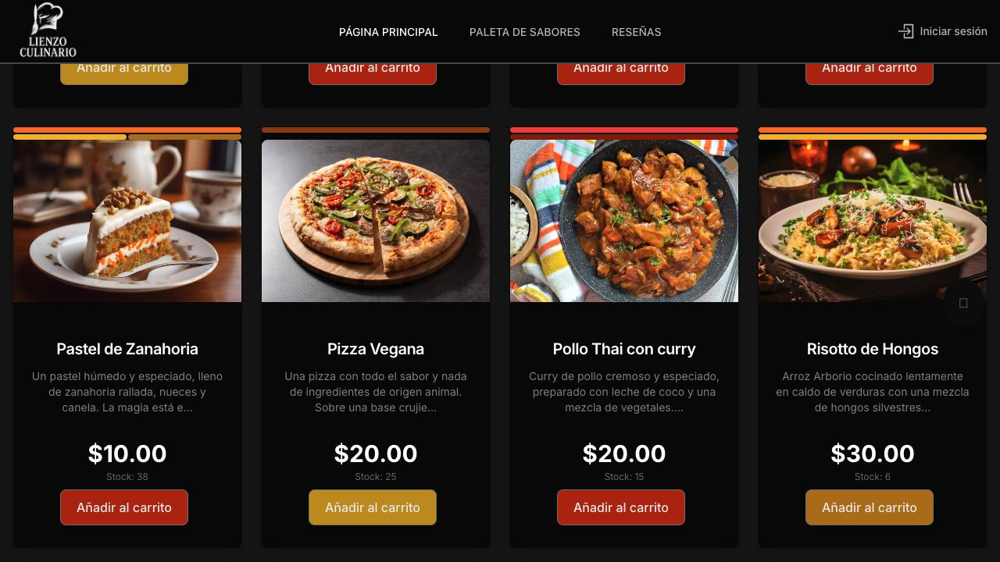
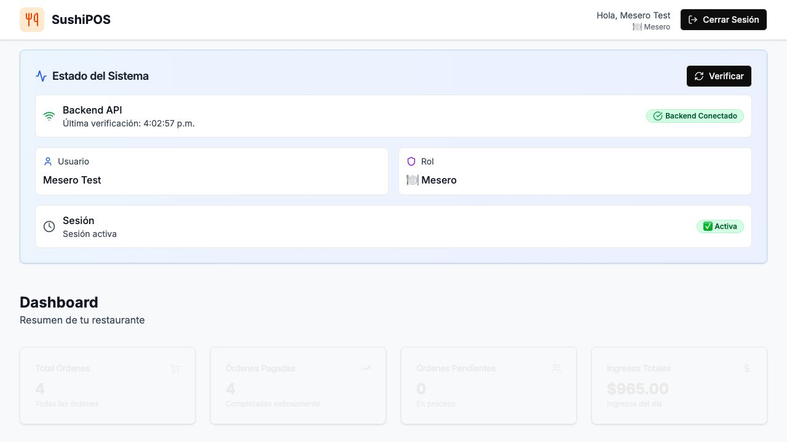
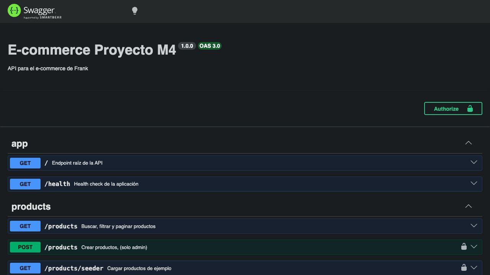

<strong>PERFIL · PROFILE</strong>

 

### ¡Hola! Soy Frank 👋

**Desarrollador Full Stack con enfoque principal en backend.**

Trabajo en el desarrollo y mantenimiento de una plataforma SaaS, creando APIs, integraciones y funcionalidades web. Me interesa construir soluciones mantenibles, conectar servicios y transformar necesidades de producto en software funcional.

🌎 **Abierto a oportunidades remotas y colaboraciones.**

---

### Experiencia profesional

#### Desarrollador Full Stack · Peek Softworks

`nov. 2025 – actualidad` · Jornada completa · Presencial 
Boca del Río, Veracruz, México

Desarrollo y mantenimiento de una plataforma SaaS para gestionar y monitorear operaciones de transporte público.

- Desarrollo de aplicaciones y servicios con NestJS, Express.js, Vue.js y Next.js.
- Integración de APIs REST y flujos de autenticación con JWT y bcrypt.
- Funcionalidades de geolocalización y geocercas con OpenStreetMap y Google Maps.
- Integración de barras contadoras de pasajeros y sistemas de cobro en efectivo, códigos QR y tarjetas NFC.
- Procesamiento de datos operativos y dashboards con métricas de pasajeros, recaudo y unidades de transporte.
- Comunicación mediante MQTT para centralizar información de un sistema heredado desarrollado con Express.js y Vue.js.
- Contenerización y despliegue con Docker en DigitalOcean, además de administración de servidores mediante SSH.
- Integraciones NFC con Python, Pascal y Delphi para lectores y tarjetas MIFARE DESFire.
- Gestión segura de credenciales con Azure Key Vault y almacenamiento de objetos con MinIO.

### Stack principal

<strong>Stack complementario</strong>

 

**Backend y datos**

**Frontend y mobile**

**Servicios e integraciones**

**Herramientas**

### Actualmente aprendiendo

Profundizo en **Flutter y Dart** para desarrollar aplicaciones móviles, consumir APIs y conectar experiencias móviles con servicios backend.

### Proyectos destacados

#### 🍽️ Lienzo Culinario

eCommerce colaborativo. Participé en el desarrollo del backend, incluyendo pagos, autenticación y gestión de recursos multimedia.

`Next.js` `NestJS` `PostgreSQL` `Stripe` `Auth0` `Cloudinary` 
[Ver backend](https://github.com/lienzoculinariog2/nuevolienzoback-) · [Abrir demo](https://lienzofront.vercel.app)

#### 🍣 Sushi POS

Punto de venta para restaurantes con usuarios, roles, productos, categorías, extras y órdenes.

`NestJS` `PostgreSQL` `TypeORM` `JWT` `Swagger` 
[Ver frontend](https://github.com/FLAranoHerrera/sushi-pos-frontend) · [Ver backend](https://github.com/FLAranoHerrera/sushi-pos-backend) · [Abrir demo](https://sushi-pos-frontend.vercel.app)

#### 🛒 Backend Ecommerce

Proyecto de especialización backend con autenticación y arquitectura modular.

`NestJS` `TypeScript` `PostgreSQL` `TypeORM` 
[Ver código](https://github.com/FLAranoHerrera/ecommcerce_m4) · [Explorar API](https://ecommerce-flarano-herrera.onrender.com/api)

<strong>English version 🇺🇸</strong>

 

### About me

I am a **Full Stack Developer with a strong backend focus**. I currently develop and maintain a SaaS platform, building APIs, integrations, and web features. I enjoy creating maintainable solutions, connecting services, and turning product requirements into working software. I am open to **remote opportunities and collaborations**.

### Professional experience

#### Full Stack Developer · Peek Softworks

`Nov 2025 – present` · Full-time · On-site 
Boca del Río, Veracruz, Mexico

I develop and maintain a SaaS platform for managing and monitoring public transportation operations.

- Build applications and services with NestJS, Express.js, Vue.js, and Next.js.
- Integrate REST APIs and authentication flows using JWT and bcrypt.
- Develop geolocation and geofencing features with OpenStreetMap and Google Maps.
- Integrate passenger-counting devices and payment systems supporting cash, QR codes, and NFC cards.
- Process operational data for dashboards covering ridership, revenue, and fleet metrics.
- Use MQTT to centralize data from a legacy Express.js and Vue.js fare-collection and passenger-counting system.
- Containerize and deploy applications with Docker on DigitalOcean and administer servers through SSH.
- Contribute to NFC integrations using Python, Pascal, Delphi, and MIFARE DESFire readers and cards.
- Manage credentials with Azure Key Vault and object storage with MinIO.

### Current focus

My core stack includes **Node.js, NestJS, TypeScript, PostgreSQL, TypeORM, React, and Next.js**. I am currently learning **Flutter and Dart**, focusing on mobile applications, API consumption, and mobile-to-backend integration.

### Featured projects

- **Lienzo Culinario:** Collaborative eCommerce platform. I contributed to its backend, including payments, authentication, and media management. [Backend](https://github.com/lienzoculinariog2/nuevolienzoback-) · [Live demo](https://lienzofront.vercel.app)
- **Sushi POS:** Restaurant point-of-sale system covering users, roles, products, categories, extras, orders, JWT authentication, and Swagger documentation. [Frontend](https://github.com/FLAranoHerrera/sushi-pos-frontend) · [Backend](https://github.com/FLAranoHerrera/sushi-pos-backend) · [Live demo](https://sushi-pos-frontend.vercel.app)
- **Backend Ecommerce:** Backend specialization project using NestJS, TypeScript, PostgreSQL, TypeORM, authentication, and modular architecture. [Source code](https://github.com/FLAranoHerrera/ecommcerce_m4) · [API](https://ecommerce-flarano-herrera.onrender.com/api)

### GitHub

### ¿Construimos algo juntos?

Estoy abierto a oportunidades remotas, conectar con otros desarrolladores, colaborar en proyectos y conversar sobre backend, SaaS e integraciones.

 

<picture>
  <source media="(prefers-color-scheme: dark)" srcset="https://raw.githubusercontent.com/FLAranoHerrera/FLAranoHerrera/output/github-contribution-grid-snake-dark.svg">
  <source media="(prefers-color-scheme: light)" srcset="https://raw.githubusercontent.com/FLAranoHerrera/FLAranoHerrera/output/github-contribution-grid-snake.svg">
  
</picture>

Basado en el concepto visual de <a href="https://github.com/10Kartik">10Kartik</a> · Actualizado el 24/07/2026

